# Caja de sonidos BETA

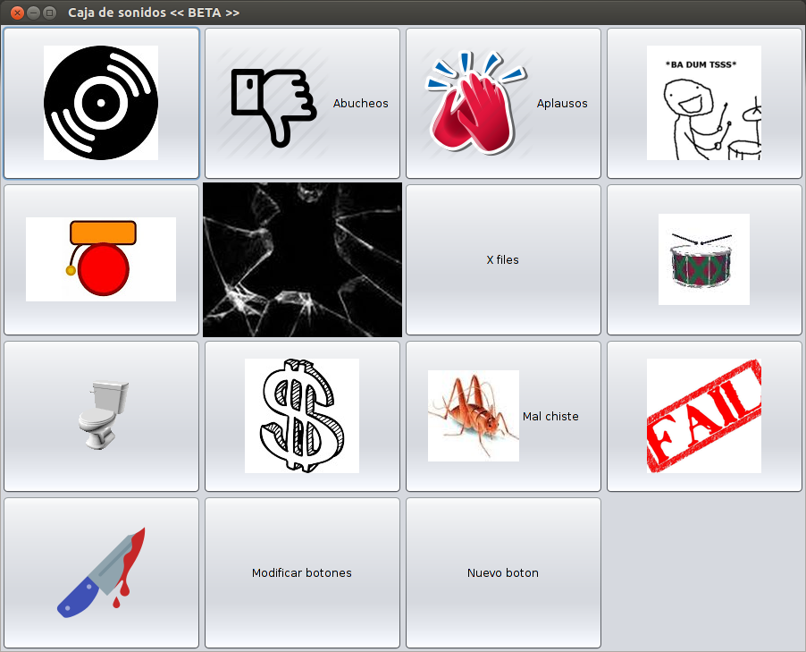

Este programa (o aplicación llamado Caja de sonidos) tiene botones con imágenes y texto los cuáles al dar click reproduce un archivo mp3 que contiene un efecto de sonido. Puede modificar los botones como la imágen que se muestra o el sonido que se reproduce, eliminar el botón y agregar nuevos botones.

# Contenido

* [Descargar el fuente o ejecutable](#descargar-el-fuente-o-ejecutable)

* [Instalar Java jdk en Windows y Ubuntu para ejecutar este programa](#instalar-java-jdk-en-windows-y-ubuntu-para-ejecutar-este-programa)

* [Usar la caja de sonidos](#usar-la-caja-de-sonidos)

    * [Reproducir un sonido](#reproducir-un-sonido)

    * [Modificar algún botón](#modificar-algun-boton) 
    
    * [Agregar un nuevo botón](#agregar-un.nuevo-boton)
    
* [Problemas conocidos](#problemas-conocidos)

* [Posibles mejoras a futuro](#posibles-mejoras-a-futuro)

* [La licencia](#la-licencia)

## Descargar el fuente o ejecutable

Lo que se encuentra en el repositorio son los archivos fuente y la libreria usada llamada JLayer.

Si lo que necesita es el archivo ejecutable para usar la caja de sonidos \(que es un archivo .jar\) lo puede encontrar [aqui](https://github.com/JuanMX/caja-de-sonidos/releases/download/v0.1-beta/Caja.de.sonidos.USUARIO.zip)

Esta caja de sonidos se programó usando el IDE NetBeans, si necesita el proyecto exportado como un archivo zip lo puede encontrar [aqui](https://github.com/JuanMX/caja-de-sonidos/releases/download/v0.1-beta/Caja.de.sonidos.PROYECTO.NETBEANS.zip)

## Instalar Java jdk en Windows y Ubuntu para ejecutar este programa

Este **NO** es el Java que se usa para ver ciertas cosas en sitios de internet (complemento Java, Java para navegadores web o como usted lo conozca), Java jdk es lo que permite programar y correr programas escritos en el lenguaje de programación Java, por ejemplo, esta caja de sonidos.

Necesita Java jdk en su versión 7 o posterior. Si usted no los tiene se muestra a continuación como  obtenerlo.

En ubuntu y derivados se debe escribir estas lineas en la terminal:

``` shell
sudo apt-get install icedtea-7-plugin openjdk-7-jre
```
``` shell
sudo apt-get install openjdk-7-jdk
```
En Windows puede encontrar jdk en su versión 8 [aquí](http://www.oracle.com/technetwork/java/javase/downloads/jdk8-downloads-2133151.html)

Debe aceptar la licencia y seleccionar el archivo .exe deacuerdo a su arquitectura.

Después debe ejecutar el archivo .exe para hacer una instalación común \( comenzar -> acepto términos y condiciones -> siguiente -> siguiente -> finalizar \).

## Usar la Caja de sonidos

En Ubuntu y similares debe realizarse mediante terminal ubicándose en donde se encuentra el .jar y escribiendo:

``` shell
java -jar Caja_de_sonidos.jar
```

En Windows debe dar doble click en el .jar o click derecho -> abrir con -> java SE binary. Para ambos casos debe aparecer una ventana parecida a la siguiente.


Algunos botones tienen uns frase de ayuda que se visualiza si pone el cursor sobre el botón por unos momentos.

* ### Reproducir un sonido

Al dar click en un botón debe escucharse un sonido, **debe esperar a que el sonido termine de reproducirse** en caso de dar click otros botones mientras se reproduce algún sonido el programa reproducirá los sonidos sin que se pueda detenerse, además de que no podrá cerrar el programa.

* ### El botón *Modificar botones*

Permite cabiar las propiedades de los botones que son: Su nombre, la frase de ayuda, el archivo mp3 que se reproduce al usar el botón y la imágen que se muestra. Además de que se puede eliminar el botón.

Al dar click en este botón se ve una ventana como la siguiente.

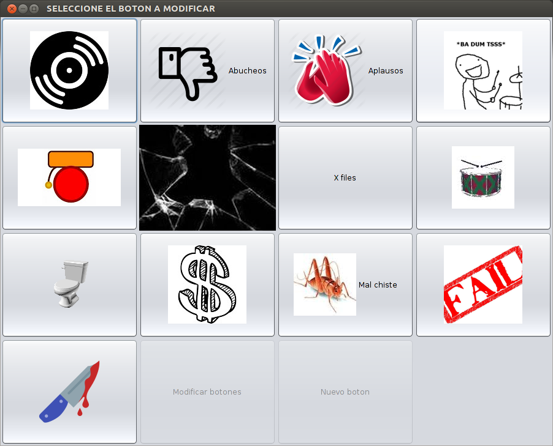

En el cual deberá dar click nuevamente en el botón que quiera modificar, en este caso se va a a dar click en el botón *Mal chiste* con la imágen de un grillo. Las modificaciones que se realizarán son quitar la imágen y poner como frase de ayuda Canto de grillo.

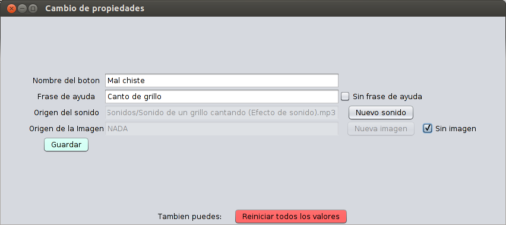

Como se puede ver las casillas de verificación permiten quitar la imágen o la frase de ayuda.

Al guardar los cambios \(click en el botón guardar\) se debe ver el mensaje de cambios agregados.


Y el resultado al cerrar y abrir la aplicación es el siguiente.

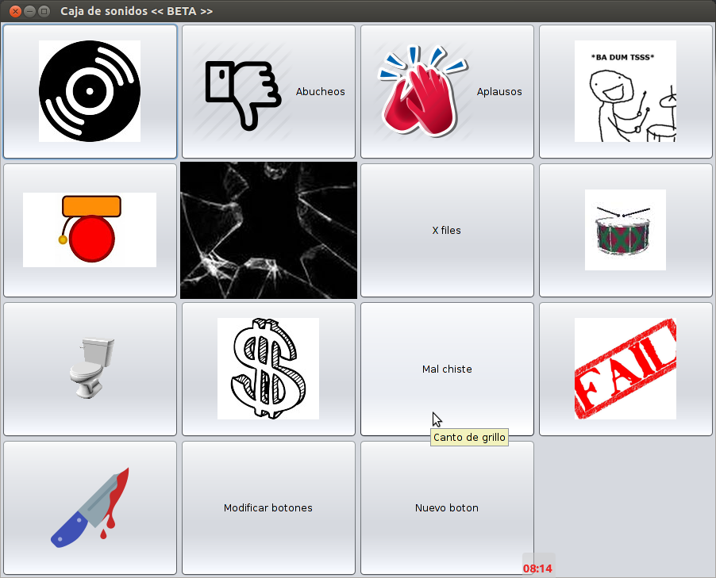
    
* #### El botón *Reiniciar todos los valores*
    
Este botón pone en todos los campos la palabra NADA, si guarda los cambios **con el campo *Origen del sonido* puesto en NADA** elimina el botón de la Caja de sonidos.

En este ejemplo se eliminará el botón que selecciona el cursor.

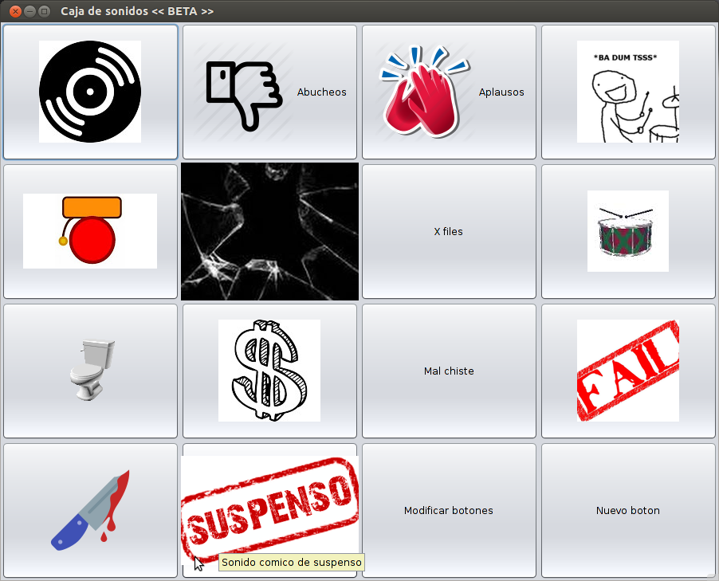

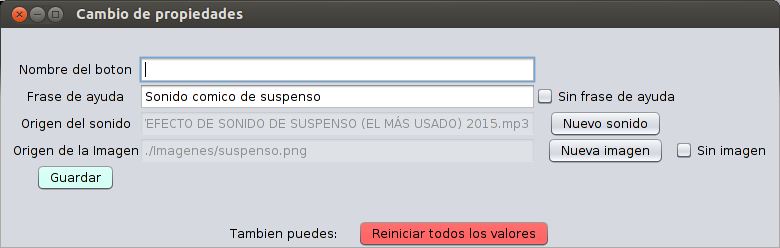

Al dar click pone en todos los campos la palabra NADA y aparece el siguiente mensaje.

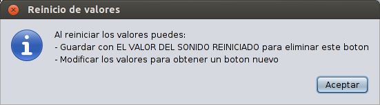

Si guardamos **con el campo *Origen del sonido* puesto en NADA** se muestra el siguiente mensaje.

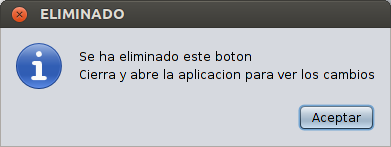

* ### El botón *Nuevo boton*

Permite agregar un botón nuevo a la Caja de sonidos.

Al dar click en este botón se ve una ventana como la siguiente.

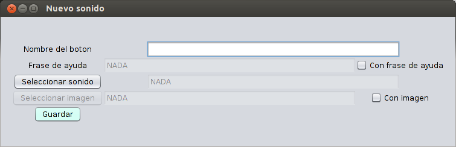

Se procede a llenar los campos, note como las casillas de verificación habilitan escribir una frase de ayuda y el seleccionar una imágen

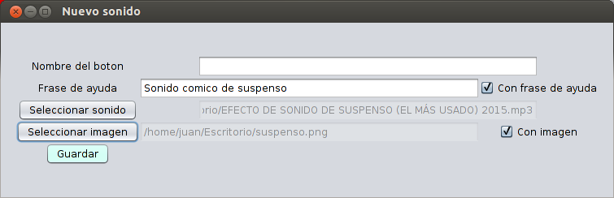

Al guardar \(click en el botón Guardar\) debe ver un mensaje como el siguiente

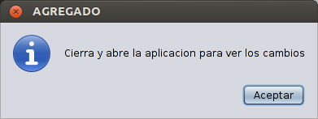

Y el resultado es el siguiente


Cuando **no** selecciona un sonido aparece un mensaje como el siguiente.

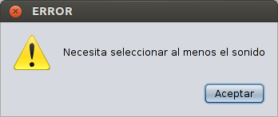

Las imágenes mostradas son del programa funcionando en Ubuntu pero si usa Windows no debe tener problemas a continuación se muestran unas imágenes.

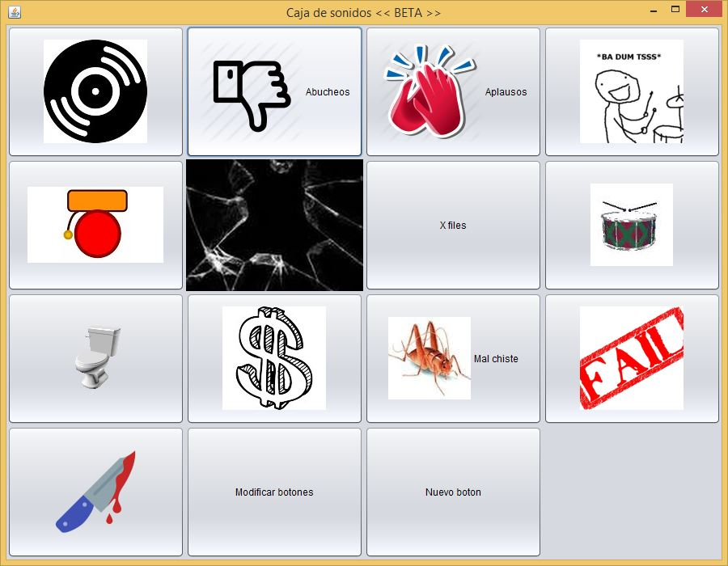

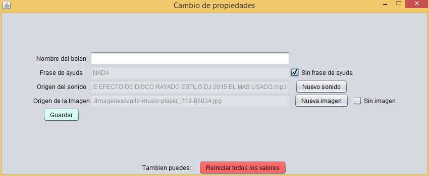

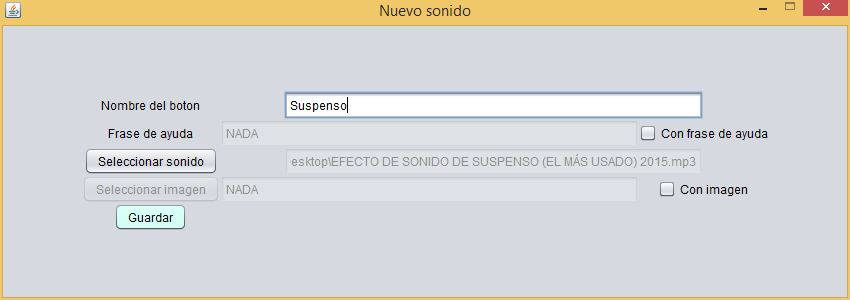

por si se encuentra interesado en el uso de recursos aquí una imágen

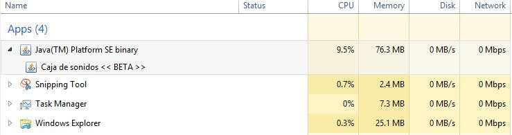


## Problemas conocidos

* Se puede quedar *colgado* el programa reporduciendo sonidos por dar click a muchos botones muy rápido. Si quiere detener el programa de manera externa puede hacer lo siguiente.
En Ubuntu puede escribir en la terminal xkill y seleccionar con el cursor \(que se verá como una x\) la ventana de la caja de sonidos.
En Windows puede mover su cursor a la barra de tareas y después dar click derecho -> abrir administrador de tareas después seleccionar la caja de sonidos y dar click en el botón finalizar tarea.

* En Ubuntu si se intenta ejecutar el .jar con doble click o *click derecho -> abrir con openjdk* no se cargan los botones con sonidos o puede aparecer un mensaje de advertencia de que hay problemas con el archivo config.config. Se recomienda abrir el .jar con la terminal. 

* Cuando se agrega un nuevo botón usando este programa el archivo *config.config* se desordena lo que puede dificultar la lectura por una persona. Si es un usuario común no debería tener problemas.

* Si se usan caracteres especiales como nombre de un botón por ejemplo la letra ñ puede verse mal al desplegar su nombre en el programa, lo mismo sucede con letras acentuadas. Se recomienda no usarlas como nombre de un botón, nombre de un archivo mp3 o imágen.

* Este programa usa JLayer que funciona para manejar archivos mp3 por lo que si se usa un archivo de audio con otra extensión puede no funcionar.

* En la ventana que se muestra para crear o modificar un botón puede verse los campos de texto muy pequeños, si esto sucede haga más grande la ventana o use el botón maximizar.

* Si usa una versión vieja de Java jdk puede verse las ventanas y botones *muy viejos*. Se recomienda usar una versión reciente de java \(versión 7 o superior\) ya que usa un tema llamado *nimbus*.

## Posibles mejoras a futuro

* Soporte UTF-8 para manejar caracteres especiales.

* Una barra de estado para la ventana principal de la caja de sonidos en la que se vea el status del programa \(reproduciendo, tiempo restante para que termine de escucharse un sonido\).

* Usos para el click derecho y scroll del mause. Por ejemplo detener la reproducción del sonido con click derecho.

* Bloquear las ventanas cuando se despliega una ventana hija. Por ejemplo, bloquear la ventana principal cuando se quiera crear un nuevo botón con sonido. 

* Mostrar los botones nuevos y modificados sin cerrar y abrir el programa.


## La licencia

El proyecto [JLayer](http://www.javazoom.net/javalayer/sources.html) de javazoom.net tiene una licencia LGPL mientras que la caja de sonidos tiene una licenica GPL-3.0 de acuerdo con [la tabla de compatibilidad de licencias](https://www.gnu.org/licenses/gpl-faq.html#AllCompatibility) de gnu ambas licencias son compatibles.

Como nota final las imágenes y sonidos usados no son de mi propiedad, se usan de manera desmostrativa sin fines comerciales.
